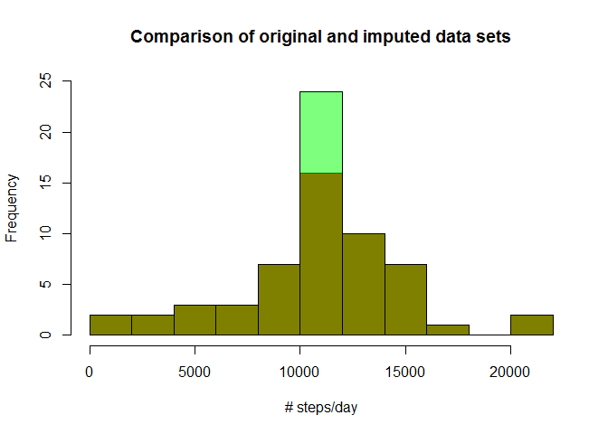

# Reproducible Research: Peer Assessment 1


## Loading and preprocessing the data

```r
data <- read.csv("activity.csv", header=T)
```


## What is mean total number of steps taken per day?
so lets plot a histogram of the # of steps/day and take a summary:


```r
agg_date <- aggregate(steps ~ date, data=data, FUN=sum)
hist(agg_date$steps, breaks=10, col="Red", main="", xlab="# steps/day")
```

 

```r
summary(agg_date)
```

```
##          date        steps      
##  2012-10-02: 1   Min.   :   41  
##  2012-10-03: 1   1st Qu.: 8841  
##  2012-10-04: 1   Median :10765  
##  2012-10-05: 1   Mean   :10766  
##  2012-10-06: 1   3rd Qu.:13294  
##  2012-10-07: 1   Max.   :21194  
##  (Other)   :47
```
the summary reports mean = 10766 and median = 10765


## What is the average daily activity pattern?

```r
agg_int <- aggregate(steps ~ interval, data=data, FUN=mean)
summary(agg_int)
```

```
##     interval          steps        
##  Min.   :   0.0   Min.   :  0.000  
##  1st Qu.: 588.8   1st Qu.:  2.486  
##  Median :1177.5   Median : 34.113  
##  Mean   :1177.5   Mean   : 37.383  
##  3rd Qu.:1766.2   3rd Qu.: 52.835  
##  Max.   :2355.0   Max.   :206.170
```

```r
plot(agg_int, type="l", main="Average Daily Activity Pattern", xlab="5-min interval", ylab="avg # steps/day")
```

 

The interval with the maximum # of steps was found by:

```r
mx <- max(agg_int$steps)
agg_int[agg_int$steps==mx,]
```

```
##     interval    steps
## 104      835 206.1698
```
indicating the average max # steps of 206.17 occurred at 8:35 am


## Imputing missing values

```r
summary(data)
```

```
##      steps                date          interval     
##  Min.   :  0.00   2012-10-01:  288   Min.   :   0.0  
##  1st Qu.:  0.00   2012-10-02:  288   1st Qu.: 588.8  
##  Median :  0.00   2012-10-03:  288   Median :1177.5  
##  Mean   : 37.38   2012-10-04:  288   Mean   :1177.5  
##  3rd Qu.: 12.00   2012-10-05:  288   3rd Qu.:1766.2  
##  Max.   :806.00   2012-10-06:  288   Max.   :2355.0  
##  NA's   :2304     (Other)   :15840
```

From the summary above, we find 2,304 rows had NA entries for steps.

To fill these data holes, I used the mean # of steps/5-min interval (agg_int) data frame

Created a new column (wd_we) and converted the date to a weekday or weekend factor and saved it to a copy of the original data, called data2:


```r
#data2$day <- weekdays(as.Date(as.character(data2$date))) #tried this 1st; no workie
data2 <- data
data2$wd_we <- as.factor(ifelse(!weekdays(as.Date(data2$date)) %in% c("Saturday", "Sunday"), "weekday","weekend"))
```

then I merged this new data frame with the agg_int data and filled all the NAs with the mean # of steps for that 5-min interval


```r
df_merge <- merge(data2, agg_int, by.x="interval", by.y="interval")
# change column names here to avoid confusion later
# steps.x = # of steps, steps.y = mean # of steps/5-min interval
names(df_merge)[2] <- "steps"
names(df_merge)[5] <- "mean"
df_merge$steps[is.na(df_merge$steps)] <- df_merge$mean[is.na(df_merge$steps)]
```

plotting a new histogram with the original data and imputed data overlaid together. The original data is red; the imputed data is bright green; where they match is brown

```r
agg_date_imp <- aggregate(steps ~ date, data=df_merge, FUN=sum)
hist(agg_date$steps, breaks=10, ylim=c(0,25), col="red", xlab="# steps/day", main="Comparison of original and imputed data sets")
hist(agg_date_imp$steps, add=T, breaks=10, col=rgb(0, 1, 0, 0.5))
```

 

```r
summary(agg_date_imp)
```

```
##          date        steps      
##  2012-10-01: 1   Min.   :   41  
##  2012-10-02: 1   1st Qu.: 9819  
##  2012-10-03: 1   Median :10766  
##  2012-10-04: 1   Mean   :10766  
##  2012-10-05: 1   3rd Qu.:12811  
##  2012-10-06: 1   Max.   :21194  
##  (Other)   :55
```

From observations of both the composite histogram plot and the summary, it appears that imputing the NAs in the original data has had little if any affect. The mean and median of the imputed data set is nearly the same as the original, but the frequency of the center bin has increased nearly 10 above the original. Surprisingly, all other bins maintain the same frequency for both data sets.


## Are there differences in activity patterns between weekdays and weekends?
create a panel plot showing a time series for each set of imputed data:


```r
library(lattice)
#xyplot(steps ~ interval | wd_we, data=data2, layout=c(2,1), type="l") #not imputed
xyplot(steps ~ interval | wd_we, data=df_merge, layout=c(2,1), type="l") #imputed
```

 

Looking at the panel plots, there are distinct differences between the measurements made during the weekday and those of the weekend. Weekday step activity is significantly higher in the mornings after 5am, where weekend step activity doesn't really begin until after 8-9am.

The data also shows a common burst of activity that begins around 3pm for both data sets.
Both data sets also appear to have both an equal duration and pause between activity bursts throughout the day. 


